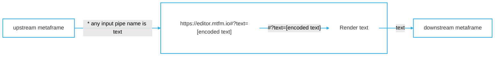

# Markdown viewer [metaframe](https://docs.metapage.io/)


Metaframe (configurable website) for showing editing code or text. It embeds the [monaco code editor](https://microsoft.github.io/monaco-editor/) (core of [VSCode](https://code.visualstudio.com/)), so you can embed code display or full on editing easily and rapidly within metapages or your own websites, without having to install or configure modules.


The URL contains the entire (editable) text/code:


> 🔗 https://editor.mtfm.io#?text=**encoded-text**


This makes the URL

- **editable**
- **sharable**
- **embeddable**
- **standalone**

[Example standalone app with an editor and the markdown renderer](https://app.metapages.org/#?definition=JTdCJTIybWV0YSUyMiUzQSU3QiUyMmxheW91dHMlMjIlM0ElN0IlMjJyZWFjdC1ncmlkLWxheW91dCUyMiUzQSU3QiUyMmRvY3MlMjIlM0ElMjJodHRwcyUzQSUyRiUyRnd3dy5ucG1qcy5jb20lMkZwYWNrYWdlJTJGcmVhY3QtZ3JpZC1sYXlvdXQlMjIlMkMlMjJsYXlvdXQlMjIlM0ElNUIlN0IlMjJoJTIyJTNBNSUyQyUyMmklMjIlM0ElMjJlZGl0b3IlMjIlMkMlMjJtb3ZlZCUyMiUzQWZhbHNlJTJDJTIyc3RhdGljJTIyJTNBZmFsc2UlMkMlMjJ3JTIyJTNBNiUyQyUyMnglMjIlM0EwJTJDJTIyeSUyMiUzQTAlN0QlMkMlN0IlMjJoJTIyJTNBNSUyQyUyMmklMjIlM0ElMjJtYXJrZG93biUyMiUyQyUyMm1vdmVkJTIyJTNBZmFsc2UlMkMlMjJzdGF0aWMlMjIlM0FmYWxzZSUyQyUyMnclMjIlM0E2JTJDJTIyeCUyMiUzQTYlMkMlMjJ5JTIyJTNBMCU3RCU1RCUyQyUyMnByb3BzJTIyJTNBJTdCJTIyY29scyUyMiUzQTEyJTJDJTIyY29udGFpbmVyUGFkZGluZyUyMiUzQSU1QjUlMkM1JTVEJTJDJTIybWFyZ2luJTIyJTNBJTVCMTAlMkMyMCU1RCUyQyUyMnJvd0hlaWdodCUyMiUzQTEwMCU3RCU3RCU3RCU3RCUyQyUyMm1ldGFmcmFtZXMlMjIlM0ElN0IlMjJlZGl0b3IlMjIlM0ElN0IlMjJ1cmwlMjIlM0ElMjJodHRwcyUzQSUyRiUyRmVkaXRvci5tdGZtLmlvJTJGJTIzJTNGYnV0dG9uJTNEaW52aXNpYmxlJTI2bWVudWhpZGRlbiUzRHRydWUlMjZvcHRpb25zJTNESlRkQ0pUSXlZWFYwYjNObGJtUWxNaklsTTBGMGNuVmxKVEpESlRJeWFHbGtaVzFsYm5WcFptbG1jbUZ0WlNVeU1pVXpRWFJ5ZFdVbE1rTWxNakp0YjJSbEpUSXlKVE5CSlRJeWJXRnlhMlJ2ZDI0bE1qSWxNa01sTWpKellYWmxiRzloWkdsdWFHRnphQ1V5TWlVelFXWmhiSE5sSlRKREpUSXlkR2hsYldVbE1qSWxNMEVsTWpKc2FXZG9kQ1V5TWlVM1JBJTNEJTNEJTI2dGFiJTNEMSUyNnRleHQlM0RKVEl6SlRJd1RXRnlhMlJ2ZDI0bE1qQm9aV0ZrWlhJbE1FRWxNRUZVYUdsekpUSXdhWE1sTWpCdFlYSnJaRzkzYmlVeU1HTnZiblJsYm5RbE1FRWxNRUZCYm1RbE1qQnpiMjFsZEdocGJtY2xNakJsYkhObEpUSXdjMjl0WlElM0QlM0QlMjIlN0QlMkMlMjJtYXJrZG93biUyMiUzQSU3QiUyMmlucHV0cyUyMiUzQSU1QiU3QiUyMm1ldGFmcmFtZSUyMiUzQSUyMmVkaXRvciUyMiUyQyUyMnNvdXJjZSUyMiUzQSUyMnRleHQlMjIlMkMlMjJ0YXJnZXQlMjIlM0ElMjJtZCUyMiU3RCU1RCUyQyUyMnVybCUyMiUzQSUyMmh0dHBzJTNBJTJGJTJGbWFya2Rvd24ubXRmbS5pbyUyRiUyMyUzRmJ1dHRvbiUzRGludmlzaWJsZSUyNm1kJTNESlRJekpUSXdWR2hwY3lVeU1HbHpKVEl3ZVc5MWNpVXlNRzFoY210a2IzZHVKVEJCSlRCQlZHaGxKVEl3VlZKTUpUSXdZMjl1ZEdGcGJuTWxNakJoYkd3bE1qQjBhR1VsTWpCamIyNTBaVzUwJTI2bWVudWhpZGRlbiUzRHRydWUlMjZvcHRpb25zJTNESlRkQ0pUSXlaR2x6Y0d4aGVXMXZaR1VsTWpJbE0wRWxNakprWldaaGRXeDBKVEl5SlRkRSUyMiU3RCU3RCUyQyUyMnBsdWdpbnMlMjIlM0ElNUIlMjJodHRwcyUzQSUyRiUyRm1ldGFwYWdlcy5vcmclMkZtZXRhZnJhbWVzJTJGbWVybWFpZC5qcyUyRiUzRlRJVExFJTNEMCUyMiUyQyUyMmh0dHBzJTNBJTJGJTJGZWRpdG9yLm10Zm0uaW8lMkYlMjMlM0ZvcHRpb25zJTNEZXlKdGIyUmxJam9pYW5OdmJpSXNJbk5oZG1Wc2IyRmthVzVvWVhOb0lqcG1ZV3h6WlN3aWRHaGxiV1VpT2lKMmN5MWtZWEpySW4wJTNEJTIyJTVEJTJDJTIydmVyc2lvbiUyMiUzQSUyMjAuMyUyMiU3RA==)


## **How to create / edit**


<div style="display: flex; justify-content: space-evenly; flex-direction: row; flex-wrap: nowrap; "><div><p>To modify the options, edit them in the webpage, then copy the URL with the copy button </p>
</div><div><p></p>
</div><div>
<br/></div></div>


## Embed in a metapage




- input pipes:
	- `text`
		- Raw markdown text
	- `*.json`
		- Any input field ending in `.json` will be JSON parsed first

## Embed code editor in another application


It requires no installation, and is secure due to cross-origin isolation.


### E.g. React


The help menu on this website uses this page in a external iframed element. While this uses `@metapages/metapage-embed-react` to make some things more convenient, you can also just embed a `<iframe src="<url>" />` element directly:


```typescript
import { useCallback } from 'react';

import { MetaframeStandaloneComponent } from '@metapages/metapage-embed-react';

export const PanelCodeEditor: React.FC<{code:string}> = ({code) => {

 const onOutputs = (text:string) => {
   // do something with the output e.g. saving 
 }
  
  return (
    <div>
      <MetaframeStandaloneComponent
        url="https://editor.mtfm.io/#?button=invisible&md=JTIzJTIwVGhpcyUyMGlzJTIweW91ciUyMG1hcmtkb3duJTBBJTBBVGhlJTIwVVJMJTIwY29udGFpbnMlMjBhbGwlMjB0aGUlMjBjb250ZW50&menuhidden=true&options=JTdCJTIyZGlzcGxheW1vZGUlMjIlM0ElMjJkZWZhdWx0JTIyJTdE"
        inputs={{ text: code}}
				onOutputs={onOutputs}
      />
    </div>
  );
};
```


## Developers: creating your own code editor links 


You can generate your own code/text editor/display pages to display in your own webpages easily as embedded iframes.


The text is simply encoded as follows:


```typescript
export const encodeText = (text: string) => {
  var b64 = window.btoa(encodeURIComponent(text));
  return b64;
};

const yourRawText = "Some code";
const encodedText = encodeText(yourRawText);
const url = `https://editor.mtfm.io/#?button=invisible&text=${encodedText}&menuhidden=true&options=JTdCJTIyZGlzcGxheW1vZGUlMjIlM0ElMjJkZWZhdWx0JTIyJTdE`
```


Just take that `url` and embed as described above, or via embedded as an iframe:


`<iframe src={url} />`

